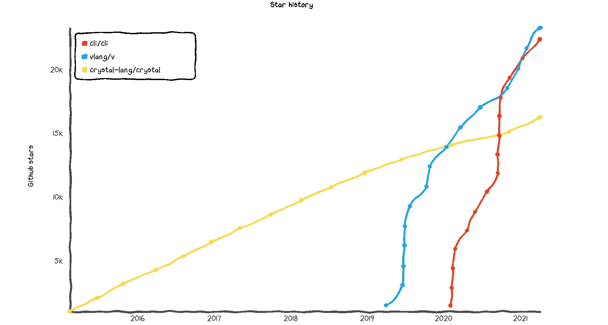

## V语言学习笔记

利用业余时间,体验了V语言,边看,边动手,边记录,所以有了这个V语言学习笔记.

### 写在前头的话

这是一门新发布的语言,由[Alexander Medvednikov](https://github.com/medvednikov)发起,开源时间为2019年6月22日,目前贡献者已有4百多人,快速迭代开发中.

目前,语言的稳定性和成熟度肯定还需要时间完善,不能期望太高.不过作者还是实现了很多不错的语言特性,也很佩服他有勇气,有能力,又开发了一门新语言,并且很努力地全职开发,快速更新.

总之,V语言还算是很有潜力的一门新语言,不喜欢的人可以忽略,喜欢的人不妨抽点时间跟进一下,一起跟着V语言成长...

V语言官网:  [https://vlang.io/]( https://vlang.io/)

V语言代码库:  [https://github.com/vlang](https://github.com/vlang)

V语言社区dicord: https://discord.com/invite/vlang

V语言学习笔记:  https://github.com/lydiandy/vlang_note

V语言学习笔记-gitbook阅读地址:  https://lydiandylin.gitbook.io/vlang

---

### **为什么喜欢V**

V感觉就是**go+rust+c**的结合体，吸收了这三者的优点,不过像go更多一点.

V也实现了自举，编译器把V代码生成C代码，然后再调用gcc或者clang来编译生成的C代码.

V的语法看着，写着都很舒服，比go和rust都好,

吸收了go和rust中的各种简洁和优秀的特性,

有个关于V语言的评论挺有意思,原文是这样:

"If Go and Rust had a baby it would be this language. Grandpa C should be proud."

"如果Go和Rust有一个孩子的话,那应该就是V,他的爷爷C,也挺自豪有这么一个孙子 :)"

对于V,主要还是看重:

1.简洁,干净的语法,看起来,写起来都很舒服.

2.没有GC,编译快,生成的执行文件很小,执行很快.

3.语言特性介于go和rust之间,比go多了一些缺失的核心特性,不会显得单调无聊,又比rust简单得多,不会显得过于复杂,难以掌握.

4.由于编译生成C代码,可以很方便地跟已有的C代码库集成,快速使用C成熟丰富的代码库.

5.安全：没有null/nil、没有全局变量、变量默认只读、边界检查、没有未定义行为.

感觉V才是 "**better C**".

当然,目前V的阶段还是比较早期的,还是不够稳定.

开发的速度挺快的，新语法特性一直在完善，bug也还挺多的，还不能用到实际的项目中.

即使1.0发布了,也有挺长的路要走,毕竟一门编译语言的发展是按年来计算的.

### V语言的目标

作者希望把V变成一个**通用编程语言**:

- 能够像C那样,成为新一代的主流静态类型语言.
- 能够像C/C++/rust那样,用来开发操作系统,数据库,浏览器等核心系统.
- 能够像shell/python那样,用来写系统脚本.
- 能够像python那样,用来写机器学习.
- 能够像go/java那样,用来写网络应用.
- 能够像C/C++那样,用来写GUI图形框架.
- 能够像ts那样,用来编译生成js前端代码.

一开始看到作者的这个目标,也是被吓了一跳,

目标挺远大,做到了就无比牛逼,也意味着工作量巨大,实现难度会比较大,周期会比较长.

### github关注度

从V的github star增长曲线图,可以看出V还是受到很多开发者的关注,star数量增长很快,同时代码更新速度也是非常快.

### **一起完善**

目前V语言的中文文档比较少,如果有兴趣一起学习,记录V语言的各种语言特性及标准库,欢迎提交pull request.

