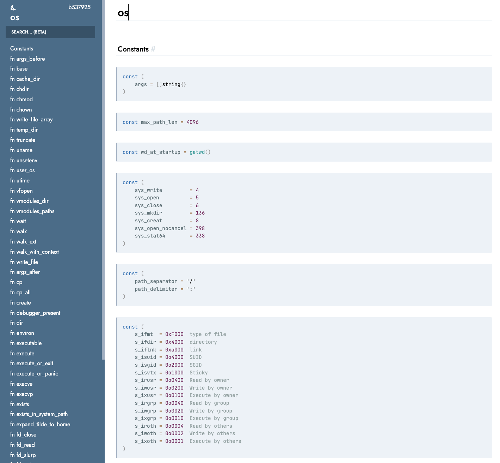

## 文档

### 生成文档

跟go一样，模块的文档可以通过使用v doc从模块代码中自动生成。

可以对指定的模块，目录，文件，一级元素生成文档。

```shell
v doc os //在终端中输出标准模块os的文档
v doc os -o os -f html //生成os文档目录,html格式

v doc os File //在终端中输出os模块中File结构体的文档
v doc os File -o file -f html //生成file文档目录,html格式

v doc vlib -o vlib -f html //生成整个标准库vlib下所有模块的文档
```

就可以生成类似的html页面：



生成的文档默认只包含pub的元素，如果也想要私有的元素，可以增加-all选项。

```shell
v doc os -all -o os.html
```

其他生成选项：

```shell
-o   //生成指定的文档目录,如果没有使用-f指定格式，且目录名后缀为.html，则生成html格式
-all //包括公共的和私有的元素
-f  //生成不同格式的文档：md,markdown,json,text,html,默认是text格式
-m //生成指定目录中指定模块的文档

-inline-assets //将css和js嵌入到生成的html页面中
-theme-dir //指定自定义文档样式主题的目录
```

想要了解更多v doc子命令的用法，可以使用：

```shell
v help doc
v doc -h
v doc -help
```

### 自定义模块文档

自己开发的模块，只要在对应结构体，函数等一级元素前写好注释，也可以使用v doc生成文档：

```v
// clearall clears all bits in the array
fn clearall() {
}
```
