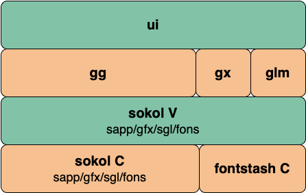

## VUI

VUI是基于sokol图形库来创建的

sokol图形库官方代码库及介绍:[https://github.com/floooh/sokol](https://github.com/floooh/sokol)

sokol图形库优点:

- 跨平台,并且不同的平台可以使用对应平台的图形驱动,性能很好:window使用DX11,mac使用metal,linux使用openGL
- 用C开发,简单,易于集成,对V来说,更容易集成
- 生成的可执行文件很小,V语言的目标比较一致
- API简单,清晰
- 支持生成WebAssembly,可以快速在web上运行

VUI本身也是一个单独的代码库:https://github.com/vlang/ui

### 安装

使用前先安装依赖:

```

```

目前vui还是早期版本,更新较快,建议直接使用源代码安装,可以随时用到最新的代码

1. 源码安装方式:

直接从git代码库下载代码,然后链接到~/.vmodules/ui,这样就可以在代码中直接import ui

```
git clone https://github.com/vlang/ui
ln -s /path/to/ui ~/.vmodules/ui
```

2. 使用vpm安装:


```
v install ui //安装ui
v update ui	//更新ui
```

### UI模块层级关系

以下图例描述了UI模块和标准库模块的关系




#### sokol模块

源代码位置:vlib/sokol

sokol模块对sokol C进行封装

sokol C代码存放在thirdparty/sokol目录中

#### gg模块

源代码位置:vlib/gg

V 2D/3D graphics library with an OpenGL backend (DirectX, Vulkan, Metal coming soon)

V绘图模块,用来在窗体上绘制各种图形

gg是glad和glfw的缩写

gg其实就是绘图部分的context的作用,觉得可以直接命名为Context更好理解

gg结构体提供进行绘制的相关方法,给全局使用,特别是组件的draw()

gg.draw_triangle() //绘制三角形

gg.draw_triangle_tex() //绘制三角形纹理

gg.draw_rect()	//绘制实心矩形

gg.draw_empty_rect()	绘制空矩形

gg.draw_circle()	//绘制圆形

gg.draw_line()	//绘制直线

...还有好多绘制的功能没有实现

#### gx模块

源代码位置:vlib/gx

主要维护了颜色,文本,字体相关的基础结构体及常量

Color结构体

标准颜色的常量值

Image结构体

TextCfg结构体

#### glm模块

源代码位置:vlib/glm

OpenGL Mathematics（GLM） - 几何数学库

Math Libraries

OpenGl中在进行图形变换的时候需要使用几何数学库

矩阵变换，四元数，数据打包，随机数，噪声等等

代码:https://github.com/g-truc/glm

#### freetype模块

源代码位置:vlib/freetype

FreeType是一个完全开源的、可扩展、可定制且可移植的字体引擎，它提供TrueType字体驱动的实现统一的接口来访问多种字体格式文件

官网:https://www.freetype.org/

#### stbi模块

源代码位置:vlib/stbi

图像库

源代码:https://github.com/nothings/stb

### UI组件

刚发布的版本,目前的组件还比较少

除了最基本的window组件是基于sokol window外,其他组件都是自行绘制的,可以在所有组件代码的draw()函数中看到自行绘制的代码

基本的思路是:使用sokol的window,context,event,然后在窗体上自行绘制所有组件:

以window组件为例,显示通用的组件创建过程

1. 定义window结构体
2. 通过new_window(cfg WindowConfig) window 创建窗体,其中WindowConfig是配置类
3. 在每一个组件中定义draw()函数,包含绘制组件代码
4. 把每一个窗体内的组件都添加到window的children[]中
5. 使用window的ui,也就是UI结构体的实例来进行绘制
6. 最后调用ui.run(window ui.Window)函数,进入for{}无限循环,然后循环调用window中所有children[]中每一个组件的draw()函数,渲染组件,类似实时绘制的效果,最后调用window.ui.gg.render()函数,完成渲染,并监听事件

因为都是采用自行绘制的,所以

才有可能同一套UI代码,除了win,linux,mac外,以后也可以自行绘制成js前端组件,wasm组件,才有可能自行完全控制

才有可能实现响应式UI,监控代码修改,然后实时更新UI,类似swiftUI,响应式UI的实现也挺简单的,因为所有界面上的组件都是实时绘制的

也因为是采用自行绘制的,组件和组件的各种属性,方法,事件都要基于glfw重新定义

#### UI结构体

UI结构体主要包含了:绘制图形的gg,绘制文字的ft,系统剪贴板clipboard

window中的ui用来进行绘制图形,绘制文字,处理剪贴板

一般来说全局只有:1个sokol.window实例,1个ui.window实例,1个ui.UI实例

#### Widget接口

所有的组件都实现了该接口

#### Window窗体


#### Canvas画布


#### Label标签


#### Button按钮


#### Textbox文本框


#### Checkbox复选框


#### Radio单选框


#### Slider滑竿


#### Dropdown下拉菜单


#### Progressbar进度条


#### Picture图像


#### Menu菜单


#### TransitionValue动画


---

## 图形库背景资料参考

OpenGL**（英语：*Open Graphics Library*，译名：**开放图形库**或者“开放式图形库”）是用于[渲染](https://baike.baidu.com/item/渲染)[2D](https://baike.baidu.com/item/2D)、[3D](https://baike.baidu.com/item/3D)[矢量图形](https://baike.baidu.com/item/矢量图形)的跨[语言](https://baike.baidu.com/item/语言)、[跨平台](https://baike.baidu.com/item/跨平台)的[应用程序编程接口](https://baike.baidu.com/item/应用程序编程接口)（API）。这个接口由近350个不同的函数调用组成，用来绘制从简单的图形比特到复杂的三维景象。而另一种程序接口系统是仅用于[Microsoft Windows](https://baike.baidu.com/item/Microsoft Windows)上的[Direct3D](https://baike.baidu.com/item/Direct3D)。OpenGL常用于[CAD](https://baike.baidu.com/item/CAD)、[虚拟现实](https://baike.baidu.com/item/虚拟现实)、科学可视化程序和电子游戏开发。

OpenGL的高效实现（利用了图形加速硬件）存在于[Windows](https://baike.baidu.com/item/Windows)，部分[UNIX](https://baike.baidu.com/item/UNIX)平台和[Mac OS](https://baike.baidu.com/item/Mac OS)。这些实现一般由显示设备厂商提供，而且非常依赖于该厂商提供的硬件

OpenGL是Khronos Group开发维护的一个规范，它主要为我们定义了用来操作图形和图片的一系列函数的API，需要注意的是OpenGL本身并非API。
GPU的硬件开发商则需要提供满足OpenGL规范的实现，这些实现通常被称为“驱动”，它们负责将OpenGL定义的API命令翻译为GPU指令。

OpenGL并非一个能够直接安装的库或包，它只是一个规范。我们只需要安装显卡的驱动即可，因为显卡驱动中就包括了对OpenGL规范的实现

由于 OpenGL 只是一个标准/规范，具体的实现是由驱动开发商针对特定显卡实现的。而 OpenGL 驱动版本众多，它大多数函数的位置都无法在编译时确定下来，需要在运行时查询。所以任务就落在了开发者身上，开发者需要在运行时获取函数地址并将其保存在一个函数指针中供以后使用。但这样写出的代码复杂繁琐，因此我们需要 GLAD,GLAD 是目前最流行的开源库，能帮我们简化这个流程

简写全称

GL:graphics library,open graphics library

GLAD: gl + load

glew: gl + Extension Wrangler

GLFW:gl + frame windows