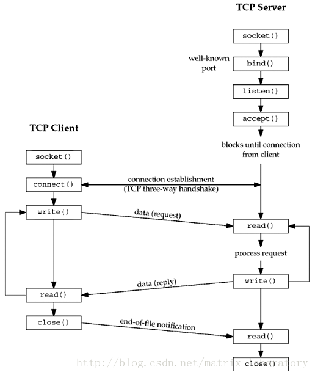

## net模块

### TCP

#### 客户端

```v
//客户端拨号
pub fn dial_tcp(address string) ?TcpConn
```

```v
//返回tcp连接
pub struct TcpConn { //实现io.Reader,io.Writer接口
pub:
	sock TcpSocket //Socket对象

mut:
	write_deadline time.Time
	read_deadline time.Time

	read_timeout time.Duration
	write_timeout time.Duration
}
```

```v
//tcp socket对象
struct TcpSocket {
pub:
	handle int //socket的文件描述符
}
```

客户端连接例子:

```v
module main

import net
import io

fn main() {
	mut client_conn := net.dial_tcp('baidu.com:80')?
	defer {
		client_conn.close()
	}
	client_conn.write_str('GET /index.html HTTP/1.0\r\n\r\n') ?
	client_conn.set_read_timeout(net.infinite_timeout)
	result := io.read_all(client_conn) ?
	println(result.bytestr())
}
```

#### 服务端

```v
//服务端启动监听
pub fn listen_tcp(port int) ?TcpListener
```

```v
//返回监听器/服务器对象
pub struct TcpListener {
	sock TcpSocket

mut:
	accept_timeout time.Duration
	accept_deadline time.Time
}
```

```v
//监听器/服务器对象,调用accept以后,开始监听,返回TcpConn对象
pub fn (l TcpListener) accept() ?TcpConn
```

服务端连接例子:

```v
module main

import net
import time

const (
	server_port = 22334
)

fn setup() (net.TcpListener, net.TcpConn, net.TcpConn) {
	listener := net.listen_tcp(server_port) or {
		panic(err)
	}
	mut client := net.dial_tcp('127.0.0.1:$server_port') or {
		panic(err)
	}
	client.set_read_timeout(3 * time.second)
	client.set_write_timeout(3 * time.second)
	mut server := listener.accept() or {
		panic(err)
	}
	server.set_read_timeout(3 * time.second)
	server.set_write_timeout(3 * time.second)
	return listener, client, server
}

fn cleanup(listener &net.TcpListener, client &net.TcpConn, server &net.TcpConn) {
	listener.close() or { }
	client.close() or { }
	server.close() or { }
}

fn main() {
	listener, client, server := setup()
	defer {
		cleanup(listener, client, server)
	}
	message := 'Hello World'
	//server
	server.write_str(message) ?
	println('message send: $message')
	println('server socket: $server.sock.handle')
	//client
	mut buf := []byte{len: 1024}
	nbytes := client.read(mut buf) ?
	received := buf[0..nbytes].bytestr()
	println('message received: $received')
	println('client socket: $client.sock.handle')
}
```


### UDP

#### 客户端


#### 服务端


### TCP网络连接图



---


