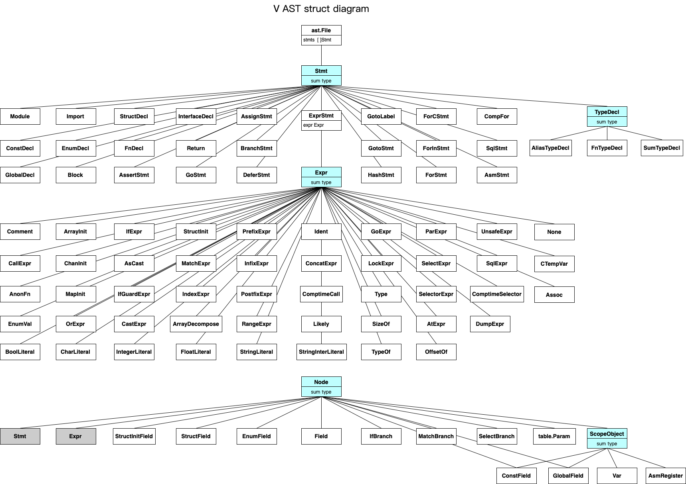

## V语言抽象语法树(AST)

V语言所有的语法树结构体都在标准库的v.ast模块中定义，主要是通过联合类型来实现。

用联合类型来实现语法树，代码显得非常的简洁，清晰。

### v ast子命令

可使用v ast子命令来生成语法树结构，这样你就可以边写代码，边查看代码对应的语法树，有助于加深对V语言语法树的理解。

```shell
v ast main.v       //生成json格式的AST语法树文件main.json
v ast -w main.v    //生成main.json,并且监控源文件变化，保存后自动重新生成
v ast -c main.v    //同时生成AST语法树文件main.json和C源代码main.c,并监控源文件变化，保存后自动重新生成
v ast -p main.v    //直接在终端中输出AST语法树
v ast -t main.v    //输出简洁版的AST语法树文件main.json[]
```

使用v ast子命令，将本章节中的示例代码生成语法树，即可查看到各种不同代码对应的语法树。

### 语法树结构体总览



### ast.File语法树文件

整个编译过程主要的步骤就是: [ ]os.File => [ ]ast.File => 目标代码(c/x64/js) => 可执行文件。

一个os.File(源代码文件)会生成一个对应的ast.File(语法树文件)。

AST结构体

```
File 语法树文件
```

示例代码

```v
module main

import os
import time

fn main() {
  
}
```

生成的AST，整个源文件的所有语句都保存在stmts语句数组节点中：

```json
{
	"ast_type": "ast.File"，
	"path": "/Users/xxx/v/vprojects/v_test/main.v"，
	"mod": {
		"ast_type": "Module"，
		"name": "main"，
		"is_skipped": false,
		"pos": {
			"line_nr": 0,
			"pos": 0,
			"len": 19
		}
	}，
	"imports": [
		{
			"ast_type": "Import"，
			"mod": "os"，
			"alias": "os"，
			"syms": []，
			"pos": {
				"line_nr": 2,
				"pos": 20,
				"len": 2
			}
		}，
		{
			"ast_type": "Import"，
			"mod": "time"，
			"alias": "time"，
			"syms": []，
			"pos": {
				"line_nr": 3,
				"pos": 30,
				"len": 4
			}
		}
	]，
	"global_scope": {
		"ast_type": "Scope"，
		"parent": "0"，
		"children": []，
		"start_pos": 0,
		"end_pos": 0,
		"objects": {}，
		"struct_fields": []
	}，
	"scope": {
		"ast_type": "Scope"，
		"parent": "7f970ef07c90"，
		"children": [
			{
				"parent": "7f970ef081f0"，
				"start_pos": 39,
				"end_pos": 51
			}
		]，
		"start_pos": 0,
		"end_pos": 53,
		"objects": {}，
		"struct_fields": []
	}，
	"errors": []，
	"warnings": []，
	"imported_symbols": {}，
	"generic_fns": []，
	"stmts": [
		{
			"ast_type": "Module"，
			"name": "main"，
			"is_skipped": false,
			"pos": {
				"line_nr": 0,
				"pos": 0,
				"len": 19
			}
		}，
		{
			"ast_type": "Import"，
			"mod": "os"，
			"alias": "os"，
			"syms": []，
			"pos": {
				"line_nr": 2,
				"pos": 20,
				"len": 2
			}
		}，
		{
			"ast_type": "Import"，
			"mod": "time"，
			"alias": "time"，
			"syms": []，
			"pos": {
				"line_nr": 3,
				"pos": 30,
				"len": 4
			}
		}，
		{
			"ast_type": "FnDecl"，
			"name": "main.main"，
			"mod": "main"，
			"is_deprecated": false,
			"is_pub": false,
			"is_variadic": false,
			"is_anon": false,
			"receiver": {
				"ast_type": "Field"，
				"name": ""，
				"typ": "void"，
				"pos": {
					"line_nr": 0,
					"pos": 0,
					"len": 0
				}
			}，
			"receiver_pos": {
				"line_nr": 0,
				"pos": 0,
				"len": 0
			}，
			"is_method": false,
			"method_idx": 0,
			"rec_mut": false,
			"rec_share": "enum:0(mut)"，
			"language": "enum:0(v)"，
			"no_body": false,
			"is_builtin": false,
			"is_generic": false,
			"is_direct_arr": false,
			"pos": {
				"line_nr": 5,
				"pos": 36,
				"len": 9
			}，
			"body_pos": {
				"line_nr": 7,
				"pos": 51,
				"len": 1
			}，
			"file": "/Users/xxx/v/vprojects/v_test/main.v"，
			"return_type": "void"，
			"source_file": 0,
			"scope": 250645264,
			"attrs": []，
			"params": []，
			"stmts": []，
			"comments": []，
			"next_comments": []
		}
	]
}
```

###  Module 模块

AST结构体

```
Module 模块声明语句
Import 模块导入语句
```

示例代码

```v
module  main

import os // comment for mod
//comment for time
import time as t
import math { min, max }

fn main() {
  
}
```

### Const 常量

AST结构体

```
ConstDecl 常量声明语句
ConstField 常量字段
```

示例代码

```v
module main

pub const p = 3.14
const (
	// version comment 1
	version = '0.2.0' // version comment 2
	usage   = 'usage:xxxx'
	pi      = 3.14
	//end comment 1
	//end comment 2
)
```

### Enum 枚举

```
EnumDecl 枚举声明语句
EnumField 枚举字段语句
EnumVal 枚举值表达式
```

示例代码

```v
module main

[attr1]
['attr2:123']
enum Color { // enum comment 1
	// black comment 1
	// black comment 2
	black = 2 // black comment 3
	// white comment 1
	// white comment 2
	white // white comment 3
	blue
	green // green comment
	// end comment 1
	// end comment 2
}

[flag]
enum BitEnum {
	e1
	e2
	e3
}

[_allow_multiple_values]
enum MultipleEnum {
	v1 = 1
}

fn main() {
	mut color := Color.black
	color = .blue
}
```

### Variable 变量

#### Assign 变量赋值语句

AST结构体

```
AssignStmt 变量赋值语句
Var 变量
```

示例代码

```v
module main

fn main() {
	// an assignment
	a := 'abc' // comment for a
	mut b := 1
	// more operator
	b = 2
	b += 2
	b -= 2
	b *= 2
	b /= 2
	b %= 2
	// multi assign
	x, y, z := 1, 'y'， 3.3
	mut xx, mut yy, zz := 1, 3, 5
	// swap variable
	mut c := 1
	mut d := 2
	c, d = d, c
}

```

#### Identifier 标识符

AST结构体

```
Ident 标识符表达式
IdentFn 函数标识符
IdentVar 变量标识符
```

示例代码

```v
module main

fn main() {
	i := 123 // common(unresolved) identifier
	_, x := 1, 2 // blank identifier
	mut s := 'abc' // with mut
	s = 'aaa'
}

```

#### Literal 字面量

AST结构体

```v
IntegerLiteral 整数字面量
FloatLiteral	小数字面量
StringLiteral	字符串字面量
StringInterLiteral 字符串模板字面量
CharLiteral 单字符字面量
BoolLiteral 布尔值字面量
```

示例代码

```v
module main

fn main() {
	a := 1 // integer literal
	b := 1.2 // float literal
	c := 'abc' // string literal
  name:='tom'
  age:= 33
  //string literal with `$xx` or `${xxx}`
	s1 := 'a is $a,b is $b,c is $c' 
	s2 := 'name is ${name}， age is ${age}'
	e := `c` // char literal
	f := true // bool literal
}
```

#### AsCast as造型语句

AST结构体

```v
AsCast as造型语句
```

示例代码

```v
module main

type Mysumtype = bool | f64 | int | string

fn main() {
	x := Mysumtype(3)
	x2 := x as int // as must be used for sumtype
	println(x2)
}
```

#### SizeOf sizeof语句

AST结构体

```v
SizeOf sizeof语句
```

示例代码

```v
module main

struct Point {
	x int
	y int
}

fn main() {
	a := sizeof(int) // basic type
	b := sizeof(bool) // basic type
	p := Point{
		x: 1
		y: 2
	}
	s1 := sizeof(Point) // struct type
	s2 := sizeof(p) // variable
}
```

#### TypeOf typeof语句

AST结构体

```v
TypeOf  typeof语句
```

示例代码

```v
module main

type MySumType = f32 | int

fn myfn(i int) int {
	return i
}

fn main() {
	a := 123
	s := 'abc'
	aint := []int{}
	astring := []string{}
	println(typeof(a)) // int
	println(typeof(s)) // string
	println(typeof(aint)) // array_int
	println(typeof(astring)) // array_string
	// sumtype
	sa := MySumType(32)
	println(typeof(sa)) // int
	// function type
	println(typeof(myfn)) // fn (int) int
}

```

#### CastExpr 造型表达式

AST结构体

```v
CastExpr 造型表达式
```

示例代码 ( todo: need more about string(buf,n) )

```v
module main

fn main() {
	x:=u8(3)
	y:=f32(2.1)
}
```

### Array 数组

#### ArrayInit 数组初始化语句

AST结构体

```v
ArrayInit 数组初始化语句
```

示例代码

```v
module main

fn main() {
	mut arr := []string{len: 3, cap: 6, init: 'default'}
	arr[0] = 'a'
	arr[1] = 'b'
	println(arr)
}
```

#### IndexExpr 索引表达式

AST结构体

```v
IndexExpr 索引表达式
```

示例代码

```v
module main

fn main() {
	mut arr := []string{len: 3, cap: 6, init: 'default'}
	arr[0] = 'a' //index expr
	arr[1] = 'b'
	println(arr)
  mut m := map[string]string{}
	m['name'] = 'tom' //index expr
	m['age'] = '33'
}
```

#### RangeExpr 数组区间表达式

AST结构体

```v
RangeExpr 数组区间表达式
```

示例代码

```v
module main

fn main() {
	n := [1, 2, 3, 4, 5]
	a1 := n[.。2] //[1, 2]
	a2 := n[2.。] //[3, 4, 5]
	a3 := n[2.。4] //[3, 4]
}
```

#### ArrayDecompose 数组解构

AST结构体

```v
ArrayDecompose 数组解构
```

示例代码

```v
module main

fn main() {
	a := ['a'， 'b'， 'c'] 
	println(variadic_fn_a(a...)) //ArrayDecompose
}

fn variadic_fn_a(a ...string) string {
	return variadic_fn_b(a...) //ArrayDecompose
}

fn variadic_fn_b(a ...string) string {
	a0 := a[0]
	a1 := a[1]
	a2 := a[2]
	return '$a0$a1$a2'
}

```

### Map 字典

#### MapInit 字典初始化

AST结构体

```v
MapInit 字典初始化
```

示例代码

```v
module main

fn main() {
	mut m := map[string]string{} //map declaration
	m['name'] = 'tom'
	m['age'] = '33'
	//map literal declaration and init
	m2 := {
		'one':   1
		'two':   2
		'three': 3
	}
}
```

### Operator 操作符

#### PrefixExpr 前缀表达式

AST结构体

```v
PrefixExpr 前缀表达式
```

示例代码

```v
module main

fn main() {
	x := -1 // minus
	p := &x // get address of variable
	x2 := *p // get value of pointer
	b := !true // logic not
	bit := ~0x0000 // bit not
}

```

#### InfixExpr 中缀表达式

AST结构体

```v
InfixExpr 中缀表达式
```

示例代码

```v
module main

fn main() {
	x := 1 + 2
	y := 1 - 2
	a := x == y // equal
	b := x > y // compare
	c := 1 in [1, 2] // in operator
	d := (x > y) && (1 < 2) // logic and
	e := 2 == 2 || 3 == 3 // logic or
	mut arr := [1, 2] // array append
	arr << 3
}
```

#### PostfixExpr 后缀表达式

AST结构体

```v
PostfixExpr 后缀表达式
```

示例代码

```v
module main

fn main() {
	mut x:=1
	x++
	x--
}

```

#### SelectorExpr 选择器表达式

AST结构体

```v
SelectorExpr 选择器表达式
```

示例代码

```v
module main

struct Point {
mut:
	x int
	y int
}

fn (mut p Point) move(a int, b int) {
	p.x += a // selector for struct field assign
	p.y += b
}

fn main() {
	mut p := Point{
		x: 1
		y: 3
	}
	p.x // selector for access field value
	p.move(2, 3)
}

```

#### ParExpr 括号表达式

AST结构体

```v
ParExpr 括号表达式
```

示例代码

```v
module main

fn main() {
	x:=(1+2)
	y:=(1<2)
}

```

#### ConcatExpr 连接表达式

AST结构体

```v
ConcatExpr 连接表达式
```

示例代码

```v
a, b, c := match false {
	true { 1, 2, 3 }
	false { 4, 5, 6 }
	else { 7, 8, 9 }
}
```

### Function 函数

#### FnDecl 函数声明

AST结构体

```v
FnDecl 函数声明语句

CallExpr 函数调用表达式

CallArg  调用参数

Return 返回值语句
```

示例代码

```v
module main

fn main() {
	s := add(1, 3)
	println(s)
	s2 := add_generic(2, 4)
	s3 := add_generic[int](2, 4)
	println(s2)
	println(s3)
}

// function
fn add(x int, y int) int {
	return x + y
}

struct Point {
	x int
	y int
}

// method
pub fn (p Point) move(a int, b int) (int, int) {
	new_x := p.x + a
	new_y := p.y + b
	return new_x, new_y
}

// generic function
fn add_generic[T](x T, y T) T {
	return x + y
}
```

#### AnonFn 匿名函数

AST结构体

```v
AnonFn 匿名函数
```

示例代码

```v
module main

fn main() {
	f1 := fn (x int, y int) int {
		return x + y
	}
	f1(1,3)
}
```

#### DeferStmt 函数defer语句

AST结构体

```v
DeferStmt  函数defer语句
```

示例代码

```v
fn main() {
	println('main start')
	// defer {defer_fn1()} 
	// defer {defer_fn2()}
	defer {
		defer_fn1()
	}
	defer {
		defer_fn2()
	}
	println('main end')
}

fn defer_fn1() {
	println('from defer_fn1')
}

fn defer_fn2() {
	println('from defer_fn2')
}
```

### Struct 结构体

#### StructDecl 结构体声明语句

AST结构体

```v
StructDecl 结构体声明语句

StructField 结构体字段

Embed 结构体组合
```

示例代码

```v
module main

[attr1]
[attr2]
struct Point { //comment 1
mut:
	x int [attr3]
	y int ['attr4=123']
pub mut:
	z int = 1
//end comment
}

fn main() {
}
```

示例代码

```v
module main

struct Widget {
mut:
	x int
	y int
}

pub fn (mut w Widget) move(x_step int, y_step int) {
	w.x += x_step
	w.y += y_step
}

struct Widget2 {
mut:
	z int
}

pub fn (mut w Widget2) move_z(z_step int) {
	w.z += z_step
}

struct Button {
	Widget //embed
	Widget2 //embed
	title string
}

fn main() {
	mut button := Button{
		title: 'Click me'
	}
	button.x = 3 // x comes from Widget
	button.z = 4 // z comes from Widget2
	println('x:$button.x,y:$button.y,z:$button.z')
	button.move(3, 4) // move comes from Widget
	println('x:$button.x,y:$button.y,z:$button.z')
	button.move_z(5) // move_z comes from Widget2
	println('x:$button.x,y:$button.y,z:$button.z')
}
```

#### StructInit 结构体初始化表达式

AST结构体

```v
StructInit 结构体初始化

StructInitField 结构体初始化字段

StructInitEmbed 结构体初始化组合
```

示例代码 

```v
module main

struct User {
	name string
	age int
}

fn add(u User) {
	println(u)
}

fn main(){
	add(User{name:'jack',age:22}) //standard
	add({name:'tom',age:23}) //short
	add(name:'tt',age:33) // more short
}
```

结构体初始化例子

```v
struct City {
	name       string
	population int
}

struct Country {
	name    string
	capital City
}

fn main() {
	ccc := Country{
		name: 'test'
		capital: City{
			name: 'city'
		}
	}
	c2 := Country{
		。。.ccc  //update_expr
		capital: City{
			name: 'city2'
			population: 200
		}
	}
	println(c2)
}
```

### Interface 接口

#### InterfaceDecl 接口声明语句

AST结构体

```v
InterfaceDecl 接口声明语句
```

示例代码

```v
module main

interface Speaker { //comment 1
	speak() string
	silent()
}
```

### Type 类型

#### AliasType 类型别名声明语句

AST结构体

```v
AliasTypeDecl 类型别名声明语句
```

示例代码

```v
module main

struct Human {
	name string
}
type Myint =  int /*comment 1*/ //comment 2
type Person = Human
```

#### FunctionType 函数类型声明语句

AST结构体

```v
FnTypeDecl  函数类型声明语句
```

示例代码

```v
module main

type Mid_fn = fn (int, string) int /*comment 1*/ //comment 2
```

#### Sumtype 联合类型

AST结构体

```v
SumTypeDecl 联合类型声明语句
```

示例代码

```v
module main

struct User {
	name string
	age  int
}

type MySumtype = User | int | string //comment 1
```

#### TypeNode 类型表达式

主要用于联合类型的match类型匹配，以及is类型判断

AST结构体

```v
TypeNode 类型表达式
```

示例代码

```v
module main

struct User {
	name string
	age  int
}

pub fn (m &User) str() string {
	return 'name:$m.name,age:$m.age'
}

type MySum = User | int | string

pub fn (ms MySum) str() string {
	if ms is int { //类型表达式
		
	}
	match ms { 
		int { //类型表达式
			return ms.str()
		}
		string { //类型表达式
			return ms 
		}
		User { //类型表达式
			return ms.str()
		}
	}
}
```

### FlowControl 流程控制

#### Block 代码块语句

AST结构体

```v
Block 代码块语句
```

示例代码

```v
fn main() {
	my_fn()
}

fn my_fn() {
	// block
	{
		println('in block')
	}
	// unsafe block
	unsafe {
	}
}
```

#### if 条件语句

AST结构体

```v
IfExpr if表达式
IfBranch if条件分支
IfGuardExpr if守护条件表达式
```

示例代码

```v
module main

//带错误的函数
fn my_fn(i int) ?int {
	if i == 0 {
		return error('Not ok!') //抛出错误
	}
	if i == 1 {
		return none //抛出错误
	}
	return i //正常返回
}

fn main() {
	a := 10
	b := 20
	// if statement
	if a < b {
		println('$a < $b')
	} else if a > b {
		println('$a > $b')
	} else {
		println('$a == $b')
	}

	// if guard expr
	if c := my_fn(2) { // if守护条件，调用函数时，正常返回，执行if分支
		println('$c')
	} else {
		println('from else')
	}
	if c := my_fn(1) { // if守护条件，调用函数时，抛出错误，执行else分支
		println('$c')
	} else {
		println('from else')
	}

	// if守护条件，其实等价于
	cc := my_fn(22) or {
		println('from or')
		0
	}
	println(cc)

	// if expr
	num := 777
	s := if num % 2 == 0 { 'even' } else { 'odd' }
	x, y, z := if true { 1, 'awesome'， 13 } else { 0, 'bad'， 0 }
	// compile time if
	$if macos {
	} $else {
	}
	println('s:$s,x:$x,y:$y,z:$z')
}
```

#### match 分支匹配

AST结构体

```v
MatchExpr 匹配表达式
MatchBranch 匹配分支
```

示例代码

```v
fn main() {
	os := 'macos'
	// match statement
	match os {
		'windows' { println('windows') }
		'macos'， 'linux' { println('macos or linux') }
		else { println('unknow') }
	}
	// match expr
	price := match os {
		'windows' { 100 }
		'linux' { 120 }
		'macos' { 150 }
		else { 0 }
	}
	// multi assign 
	a, b, c := match false {
		true { 1, 2, 3 }
		false { 4, 5, 6 }
		else { 7, 8, 9 }
	}
}

type MySum = bool | int | string

pub fn (ms MySum) str() string {
	// match sum type
	match ms {
		int { return ms.str() }
		string { return ms }
		else { return 'unknown' }
	}
}
```

#### for 循环语句

AST结构体

```v
ForCStmt forC循环语句
ForInStmt forin循环语句
ForStmt for循环语句
BranchStmt 分支语句
```

示例代码

```v
fn main() {
	for i := 0; i < 10; i++ {
		if i == 6 {
			continue
		}
		if i == 10 {
			break
		}
		println(i)
	}
}
```

示例代码

```v
fn main() {
	// string
	str := 'abcdef'
	for s in str {
		println(s.str())
	}
	// array
	numbers := [1, 2, 3, 4, 5]
	for num in numbers {
		println('num:$num')
	}
	// range
	mut sum := 0
	for i in 1 。。 11 {
		sum += i
	}
	// map
	m := {
		'name': 'jack'
		'age':  '20'
		'desc': 'good man'
	}
	for key, value in m {
		println('key:$key,value:$value')
	}
}
```

示例代码

```v
fn main() {
	mut sum := 0
	mut x := 0
	for x <= 100 {
		sum += x
		x++
	}
	println(sum)
	// label for
	mut i := 4
	goto L1
	L1: for { // label for
		i++
		for {
			if i < 7 {
				continue L1
			} else {
				break L1
			}
		}
	}
}
```

#### goto 跳转语句

AST结构体

```
GotoLabel 跳转标签
GotoStmt 跳转语句
```

示例代码

```v
fn main() {
	mut i := 0
	a: // goto label
	i++
	if i < 3 {
		goto a
	}
	println(i)
}
```

### Error handle 错误控制

AST结构体

```v
OrExpr or表达式
None none表达式
```

示例代码

```v
fn my_fn(i int) ?int {
	if i == 0 {
		return error('Not ok!')
	}
	if i == 1 {
		return none
	}
	return i
}

fn main() {
	println('from main') // OrKind is absent
	v1 := my_fn(0) or { // OrKind is block
		println('from 0')
		panic(err)
	}
	v2 := my_fn(1) or { 
		println('from 1') 
		panic('error msg is $err')	
	}
	v3 := my_fn(2) or {
		println('from 2')
		return
	}
	v4 := my_fn(3) ? // OrKind is propagate
}

```

### Concurrent 并发

#### ChanInit 通道初始化

AST结构体

```v
ChanInit 通道初始化语句
GoStmt go并发语句
```

示例代码

```v
module main

const (
	num_iterations = 10000
)

fn do_send(ch chan int) {
	for i in 0 。。 num_iterations {
		ch <- i
	}
}

fn main() {
	ch := chan int{cap: 1000} // chan init
	go do_send(ch) // go statement
	mut sum := i64(0)
	for _ in 0 。。 num_iterations {
		sum += <-ch
		println(sum)
	}
}
```

#### SelectExpr 通道监听表达式

AST结构体

```v
SelectExpr 通道监听表达式
SelectBranch 通道监听分支
```

示例代码

```v
import time
import sync

fn main() {
	ch1 := chan int{}
	ch2 := chan int{}
	go send(ch1, ch2)
	mut x := 0
	mut y := 0
	for {
		select { // 
			x = <-ch1 { // read channel
				println('$x')
			}
			y = <-ch2 {
				println('$y')
			}
			> 2 * time.second { // timeout
				break
			}
		}
	}
}

fn send(ch1 chan int, ch2 chan int) {
	ch1 <- 1
	ch2 <- 2
	ch1 <- 3
	ch2 <- 4
	ch1 <- 5
	ch2 <- 6
}
```

#### LockExpr 并发锁表达式

AST结构体

```v
LockExpr 并发锁表达式
```

示例代码

```v
module main

import time

struct St {
mut:
	x f64
}

fn f(x int, y f64, shared s St,shared m map[string]string) {
	time.usleep(50000)
	lock s,m { 
		s.x = x * y
		println(s.x)
		unsafe {
			m['a']='aa'
		}
		println(m['a'])
	}
	return
}

fn main() {
	shared t := &St{}
	shared m := &map[string]string
	unsafe {
		m['a']='aa'
	}
	r := go f(3, 4.0, shared t,shared m) 
	r.wait()
	rlock t { 
		println(t.x)
	}
}
```

#### GoExpr 并发表达式

AST结构体

```
GoExpr 并发表达式
```

示例代码

```v
module main

import time

fn do_something() { 
 println('start do_something.。。')
	time.sleep(2) 
	println('end do_something')
}
fn add(x int, y int) int { 
	println('add start.。。')
	time.sleep(4) //
	println('end add')
	return x + y
}

fn main() {
  g:= go do_something()
  g2 := go add(3, 2) 
  g.wait() 
	result := g2.wait()
	println(result)
}
```

### Unsafe 不安全代码

AST结构体

```
UnsafeExpr 不安全代码表达式
```

示例代码

```v
module main

fn main() {
	a := ['a'， 'b'， 'c']
	p := unsafe { &a[2] } // unsafe expr
	println(p)
}
```

### ASM 汇编

AST结构体

```v
AsmStmt 汇编语句

AsmTemplate
AsmClobbered
AsmIO
AsmArg
AsmAddressing
AsmAlias
AsmRegister
```

示例代码

```v
fn main() {
	a := 100
	b := 20
	mut c := 0
	asm amd64 {
		mov eax, a
		add eax, b
		mov c, eax
		; =r (c) // output 
		; r (a) // input 
		  r (b)
	}
	println('a: $a') // 100
	println('b: $b') // 20
	println('c: $c') // 120
}

```

### SQL SQL语句

AST结构体

```
SqlStmt sql语句
SqlExpr sql表达式
```

示例代码

```v
module main

import sqlite

struct Module {
	id           int
	name         string
	nr_downloads int
}

struct User {
	id             int
	age            int
	name           string
	is_customer    bool
	skipped_string string [skip]
}

struct Foo {
	age int
}

fn main() {
	db := sqlite.connect(':memory:') or { panic(err) }
	db.exec('drop table if exists User')
	db.exec("create table User (id integer primary key, age int default 0, name text default ''， is_customer int default 0);")
	name := 'Peter'
	db.exec("insert into User (name, age) values ('Sam'， 29)")
	db.exec("insert into User (name, age) values ('Peter'， 31)")
	db.exec("insert into User (name, age, is_customer) values ('Kate'， 30, 1)")
	nr_all_users := sql db {
		select count from User
	}
	println('nr_all_users=$nr_all_users')
	//
	nr_users1 := sql db {
		select count from User where id == 1
	}
	println('nr_users1=$nr_users1')
	//
	nr_peters := sql db {
		select count from User where id == 2 && name == 'Peter'
	}
	//
	new_user := User{
		name: 'New user'
		age: 30
	}
	sql db {
		insert new_user into User
	}
	sql db {
		update User set age = 31 where name == 'Kate'
	}
	sql db {
		delete from User where age == 34
	}
}
```

### TestAssert 测试断言

#### AssertStmt 测试断言语句

AST结构体

```v
AssertStmt 测试断言语句
```

示例代码

```v
fn test_abc() {
	x := 1
	assert x == 1
}
```

#### DumpExpr 转储函数表达式

AST结构体

```v
DumpExpr 转储函数表达式
```

示例代码

```v
fn factorial(n u32) u32 {
	if dump(n <= 1) {
		return dump(1)
	}
	return dump(n * factorial(n - 1))
}

fn main() {
	println(factorial(5))
}
```

### Compile time 编译时

#### CompFor 编译时循环语句

AST结构体

```v
CompFor 编译时循环语句
ComptimeCall 编译时调用表达式
ComptimeSelector 编译时选择器表达式
```

示例代码

```v
struct App {
	a string
	b string
mut:
	c int
	d f32
pub:
	e f32
	f u64
pub mut:
	g string
	h u8
}

fn (mut app App) m1() {
}

fn (mut app App) m2() {
}

fn (mut app App) m3() int {
	return 0
}

fn main() {
	$for field in App.fields {
		println('field: $field.name')
	}
	$for method in App.methods {
		println('method: $method.name')
	}
}

```

#### AtExpr at全局常量表达式

AST结构体

```v
AtExpr at全局常量量表达式
```

示例代码

```v
module main

fn main() {
	println('module: ${@MOD}')			//当前模块
	println('fn: ${@FN}')				//当前函数
	println('sturct: ${@STRUCT}')		//当前结构体
	println('method: ${@METHOD}')		//当前方法
	println('vexe: ${@VEXE}')			//当前V编译器命令行可执行文件
	println('vexeroot: ${@VEXEROOT}')	//当前V编译器命令行所在的目录
	println('file: ${@FILE}')			//当前源代码文件名
	println('line: ${@LINE}')			//当前代码所在的行
	println('column: ${@COLUMN}')		//当前代码在当前行中的列数
	println('vhash: ${@VHASH}')			//当前V命令行编译时的hash	
	println('vmod_file: ${@VMOD_FILE}')	//当前文件所处项目的v.mod文件内容
	println('vmodroot: ${@VMODROOT}')	//当前文件所处项目的v.mod文件所在的目录
}
```

### C Integration C代码互操作

#### GlobalDecl 全局变量声明

AST结构体

```v
GlobalDecl 全局变量声明
GlobalField 全局字段声明
```

示例代码

```v
module main

// single
__global  g1 int

// group
__global (
	g2 u8 
	g3 u8 
)

fn main() {
	g1 = 1
	g2 = 2
	g3 = 3
	println(g1)
	println(g2)
	println(g3)
}
```

#### HashStmt C宏指令语句

AST结构体

```v
HashStmt C宏指令语句
```

示例代码

```v
module main
    
#include <stdio.h> 

#flag -lmysqlclient
#flag linux -I/usr/include/mysql
#include <mysql.h>

fn main() {

}
```

#### Likely likely表达式

AST结构体

```v
Likely
```

示例代码

```v
module main

fn main() {
	x := 1
	if _likely_(x == 1) {
		println('a')
	} else {
		println('b')
	}
	if _unlikely_(x == 1) {
		println('a')
	} else {
		println('b')
	}
}
```

#### OffsetOf 结构体字段内存偏移量

AST结构体

```v
OffsetOf 结构体字段内存偏移量
```

示例代码

```v
module main

struct User {
	name [50]u8
	age int
	desc string
}

fn main() {
	offset_name:=__offsetof(User,name)
	offset_age:=__offsetof(User,age)
	offset_desc:=__offsetof(User,desc)
	println(offset_name)
	println(offset_age)
	println(offset_desc)
}
```

### Comment 注释

AST结构体

```v
Comment 注释
```

示例代码

```v
module main
/*
multi line comment
multi line comment
*/
// signle line comment
fn main() {
	x := 1 // behind statement comment
}
```

### Other 其他

#### Empty 空语句/表达式

只在编译内部使用，用来判断空语句和空表达式。

AST结构体

```v
EmptyStmt 空语句
EmptyExpr 空表达式
```

#### NodeError 错误节点

只在编译内部使用，当解析器报错时，返回NodeError节点。

NodeError既是语句，也是表达式。
